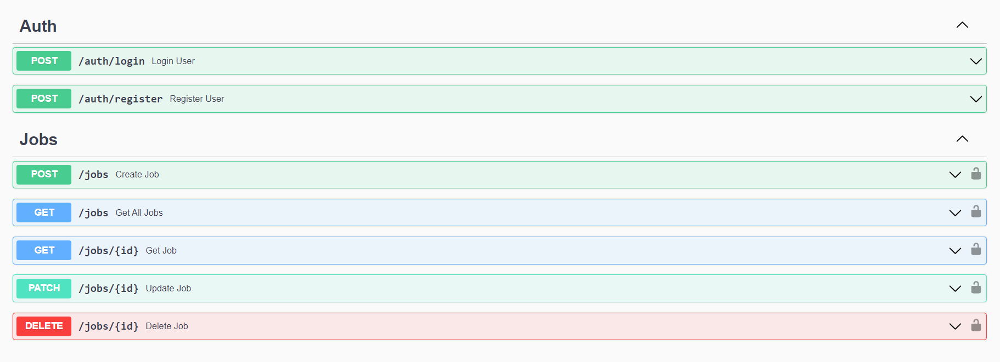

# Jobs API

An API where only authenticated users can make jobs CRUD operations

##### Project Setup

- Create .env file in the root folder, then add MONGO_URI and JWT_SECRET
  &nbsp;
- Then run
  ```bash
  npm install && npm start
  ```

##### Things I learned / practiced on

- MVC Structure
- Register User
  - Validate name, email, password with Mongoose
  - Hash password (with bcryptjs)
  - Save user
  - Generate token
  - Send response with token
- Login user
  - Validate email, password in controller
  - If email or password is missing, throw BadRequestError
  - Find user
  - Compare passwords
  - If no user or password does not match, throw UnauthenticatedError
  - If correct, generate token
  - Send response with token
- Handling Validation Errors / Duplicate (Email) / Cast Error
- Using Security Packages
  - helmet
  - cors
  - xss-clean
  - express-rate-limit
- APImatic / Swagger UI for the docs

##### Documentation Screenshot


